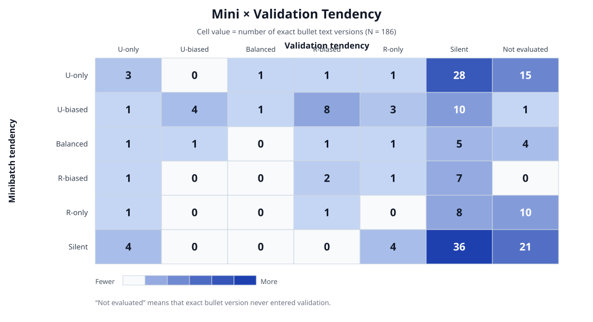

# ACE 15-Iteration Bullet Exposure and Trigger Audit

This report covers every distinct bullet text version actually shown to a
Checker in the formal 15-iteration run
`ace-codex-formal24-15it-v1-20260925`.

## Counting rules

- The canonical run contains 30 minibatch evaluations and 9 validation
  evaluations, totaling 1,044 pair-level metric calls.
- Five operationally repeated raw batches are excluded by exact content
  identity: the same playbook and the same ordered Checker inputs.
- A bare ID is not globally unique across candidate branches. The same
  `plan-xxxxx` can name different text in different proposals.
- `Audit ID` therefore identifies one exact text version in this report.
- `Observed ID` is reported only when that text appears in a retained
  candidate. `unretained` means the text appeared in an evaluated rejected
  proposal and its branch-local ID cannot be recovered from retained candidate
  authority without guessing.
- Each minibatch exposure supplies 24 R-Plan and 24 U-Plan opportunities.
  Each validation exposure supplies 36 opportunities of each kind.
- The four trigger columns report `triggered Plans / examined Plans`
  separately for Mini × R, Mini × U, Validation × R, and Validation × U.
  A dash means that the bullet version had no exposure in that split.
- Split tendency uses these deterministic labels:
  `Silent` (no triggers), `U-only`, `R-only`, `U-biased` (both trigger,
  U > R), `R-biased` (both trigger, R > U), `Balanced` (equal nonzero
  triggers), and `Not evaluated`.
- Final classification is the Cartesian product
  `Mini tendency → Validation tendency`; the two stages are not collapsed.
- Overall reject precision is
  `all U triggers / (all R triggers + all U triggers)`. It is undefined when
  the rule never triggers.
- Because rules overlap in the real Checker, standalone rule statistics cannot
  be added to obtain the complete Checker's metric.
- History entries use `batch-prefix:R/U`, where R and U are the numbers of
  Resolved-plan and Unresolved-plan Checker triggers in that evaluation.

## Summary

| Measure | Count |
|---|---:|
| Distinct bullet text versions | 186 |
| Validation evaluated | 135 |
| Validation not evaluated | 51 |

## Mini × Validation tendency matrix

Each cell is the number of exact bullet text versions with that joint
classification.

| Mini \ Validation | U-only | U-biased | Balanced | R-biased | R-only | Silent | Not evaluated | Row total |
|---|---:|---:|---:|---:|---:|---:|---:|---:|
| U-only | 3 | 0 | 1 | 1 | 1 | 28 | 15 | 49 |
| U-biased | 1 | 4 | 1 | 8 | 3 | 10 | 1 | 28 |
| Balanced | 1 | 1 | 0 | 1 | 1 | 5 | 4 | 13 |
| R-biased | 1 | 0 | 0 | 2 | 1 | 7 | 0 | 11 |
| R-only | 1 | 0 | 0 | 1 | 0 | 8 | 10 | 20 |
| Silent | 4 | 0 | 0 | 0 | 4 | 36 | 21 | 65 |
| Column total | 11 | 5 | 2 | 13 | 10 | 94 | 51 | 186 |

## Inventory

| Audit ID | Observed ID | Mini exp. | Val exp. | Mini R | Mini U | Mini tendency | Val R | Val U | Val tendency | Joint tendency | Overall reject precision | Bullet text |
|---|---|---:|---:|---:|---:|---|---:|---:|---|---|---:|---|
| B001 | plan-00001 | 30 | 9 | 0/720 | 0/720 | Silent | 0/324 | 0/324 | Silent | Silent → Silent | N/A | The Plan is a placeholder. |
| B002 | plan-00002 | 7 | 2 | 3/168 | 6/168 | U-biased | 4/72 | 4/72 | Balanced | U-biased → Balanced | 58.8% | The Plan contradicts an explicit required result or acceptance example. |
| B003 | plan-00003 | 7 | 2 | 2/168 | 8/168 | U-biased | 2/72 | 6/72 | U-biased | U-biased → U-biased | 77.8% | The Plan’s regression tests encode its proposed workaround instead of independently asserting the required contract. |
| B004 | plan-00004 | 6 | 1 | 6/144 | 7/144 | U-biased | 5/36 | 4/36 | R-biased | U-biased → R-biased | 50.0% | The Plan fixes one caller after identifying the defect in a shared component. |
| B005 | plan-00005 | 6 | 2 | 6/144 | 14/144 | U-biased | 9/72 | 1/72 | R-biased | U-biased → R-biased | 50.0% | The Plan tests only a downstream symptom and omits a direct regression for the identified shared component. |
| B006 | plan-00006 | 6 | 2 | 12/144 | 8/144 | R-biased | 7/72 | 2/72 | R-biased | R-biased → R-biased | 34.5% | The Plan changes shared code without auditing other supported uses of that code. |
| B007 | plan-00007 | 7 | 2 | 2/168 | 10/168 | U-biased | 2/72 | 0/72 | R-only | U-biased → R-only | 71.4% | The Plan changes an analogous, unreported subsystem solely because its implementation looks similar. |
| B008 | plan-00008 | 7 | 2 | 3/168 | 8/168 | U-biased | 0/72 | 0/72 | Silent | U-biased → Silent | 72.7% | The Plan rewrites passing tests outside the affected subsystem without evidence that their contract should change. |
| B009 | plan-00009 | 6 | 1 | 0/144 | 0/144 | Silent | 0/36 | 0/36 | Silent | Silent → Silent | N/A | The Plan makes an input count configurable without updating dependent fixed offsets. |
| B010 | plan-00010 | 7 | 2 | 0/168 | 0/168 | Silent | 0/72 | 0/72 | Silent | Silent → Silent | N/A | The Plan replaces an unresolved tri-state result with a definitive value that its evidence does not prove. |
| B011 | plan-00011 | 7 | 2 | 0/168 | 3/168 | U-only | 0/72 | 0/72 | Silent | U-only → Silent | 100.0% | The Plan treats distinct falsy or sentinel values as interchangeable without verifying the API’s exact value and type. |
| B012 | plan-00012 | 7 | 2 | 1/168 | 2/168 | U-biased | 0/72 | 0/72 | Silent | U-biased → Silent | 66.7% | The Plan abandons valid per-item results when one mixed input remains unresolved. |
| B013 | plan-00013 | 7 | 2 | 0/168 | 0/168 | Silent | 0/72 | 2/72 | U-only | Silent → U-only | 100.0% | The Plan relies on a fallback without tracing the value and operands its caller will return. |
| B014 | plan-00014 | 7 | 2 | 0/168 | 4/168 | U-only | 0/72 | 0/72 | Silent | U-only → Silent | 100.0% | The Plan generates importable names without testing objects defined in local or nested scopes. |
| B015 | plan-00015 | 7 | 2 | 1/168 | 1/168 | Balanced | 0/72 | 0/72 | Silent | Balanced → Silent | 50.0% | The Plan replaces an out-of-range sentinel with a valid data value that cannot represent the sentinel state at equality. |
| B016 | plan-00016 | 7 | 2 | 0/168 | 5/168 | U-only | 0/72 | 0/72 | Silent | U-only → Silent | 100.0% | The Plan implements a transitional warning although the checked-out release requires final behavior and already contains its prerequisites. |
| B017 | plan-00017 | 5 | 1 | 17/120 | 23/120 | U-biased | 4/36 | 2/36 | R-biased | U-biased → R-biased | 54.3% | The Plan leaves incompatible behavior alternatives unresolved, making its implementation and test expectations ambiguous. |
| B018 | plan-00018 | 7 | 2 | 0/168 | 2/168 | U-only | 0/72 | 0/72 | Silent | U-only → Silent | 100.0% | The Plan fixes correctness by dropping an established optimization without preserving its tested performance contract. |
| B019 | plan-00019 | 7 | 2 | 1/168 | 1/168 | Balanced | 0/72 | 1/72 | U-only | Balanced → U-only | 66.7% | The Plan dismisses new regression failures as environmental without comparing the same tests against baseline. |
| B020 | plan-00020 | 7 | 2 | 0/168 | 0/168 | Silent | 0/72 | 0/72 | Silent | Silent → Silent | N/A | The Plan skips an optional value without preserving the public result’s required cardinality and sentinel entries. |
| B021 | plan-00021 | 6 | 1 | 6/144 | 2/144 | R-biased | 0/36 | 0/36 | Silent | R-biased → Silent | 25.0% | The Plan adds a stronger semantic guarantee than the task requires or the stored state can support. |
| B022 | plan-00022 | 7 | 2 | 0/168 | 1/168 | U-only | 0/72 | 0/72 | Silent | U-only → Silent | 100.0% | The Plan uses local time for behavior whose contract and outputs are UTC. |
| B023 | plan-00023 | 7 | 2 | 0/168 | 0/168 | Silent | 0/72 | 0/72 | Silent | Silent → Silent | N/A | The Plan’s examples do not test equality and the first value beyond a strict boundary. |
| B024 | plan-00024 | 7 | 2 | 0/168 | 0/168 | Silent | 0/72 | 0/72 | Silent | Silent → Silent | N/A | The Plan infers branch reachability from source representation rather than the normalized value tested by the code. |
| B025 | plan-00025 | 7 | 2 | 0/168 | 0/168 | Silent | 0/72 | 0/72 | Silent | Silent → Silent | N/A | The Plan infers scalar cardinality from shape alone without checking constructor inputs or backing storage. |
| B026 | plan-00026 | 7 | 2 | 0/168 | 3/168 | U-only | 0/72 | 0/72 | Silent | U-only → Silent | 100.0% | The Plan treats a current test expectation as immutable despite the task explicitly changing that behavior. |
| B027 | plan-00027 | 7 | 2 | 0/168 | 0/168 | Silent | 0/72 | 0/72 | Silent | Silent → Silent | N/A | The Plan removes contextual output without checking whether another rendered element already supplies that context. |
| B028 | plan-00028 | 7 | 2 | 0/168 | 0/168 | Silent | 0/72 | 0/72 | Silent | Silent → Silent | N/A | The Plan’s proposed comparison contradicts the repository’s documented level ordering. |
| B029 | plan-00029 | 5 | 1 | 0/120 | 1/120 | U-only | 0/36 | 0/36 | Silent | U-only → Silent | 100.0% | The Plan changes a polymorphic failure fallback without testing established failure-path behavior. |
| B030 | plan-00030 | 7 | 2 | 5/168 | 4/168 | R-biased | 0/72 | 0/72 | Silent | R-biased → Silent | 44.4% | The Plan’s only regression test depends on an unavailable optional integration, leaving the shared contract untested. |
| B031 | plan-00002 | 9 | 3 | 1/216 | 6/216 | U-biased | 3/108 | 0/108 | R-only | U-biased → R-only | 60.0% | Reject if the Plan broadens a localized fix to additional components without evidence that each change is necessary. |
| B032 | plan-00003 | 9 | 3 | 3/216 | 6/216 | U-biased | 13/108 | 2/108 | R-biased | U-biased → R-biased | 33.3% | Reject if the Plan fixes only a downstream consumer when the defect originates in a shared producer or primitive. |
| B033 | plan-00006 | 8 | 2 | 3/192 | 0/192 | R-only | 4/72 | 1/72 | R-biased | R-only → R-biased | 12.5% | Reject if regression tests cover only an end-to-end symptom while omitting the directly affected component contract. |
| B034 | plan-00007 | 9 | 3 | 4/216 | 3/216 | R-biased | 9/108 | 3/108 | R-biased | R-biased → R-biased | 31.6% | Reject if validation omits non-default modes or negative variants of a changed shared helper. |
| B035 | plan-00009 | 9 | 3 | 0/216 | 0/216 | Silent | 0/108 | 0/108 | Silent | Silent → Silent | N/A | Reject if retained schema fields lose malformed-payload validation after a migration. |
| B036 | plan-00010 | 9 | 3 | 3/216 | 5/216 | U-biased | 0/108 | 1/108 | U-only | U-biased → U-only | 66.7% | Reject if a sentinel can equal a valid value despite representing a state outside the valid domain. |
| B037 | plan-00011 | 9 | 3 | 5/216 | 3/216 | R-biased | 0/108 | 0/108 | Silent | R-biased → Silent | 37.5% | Reject if a bounded-domain predicate checks only one required bound. |
| B038 | plan-00012 | 9 | 3 | 1/216 | 1/216 | Balanced | 1/108 | 0/108 | R-only | Balanced → R-only | 33.3% | Reject if protocol delegation is inferred from broad conversion exceptions rather than explicit capability checks. |
| B039 | plan-00013 | 9 | 3 | 0/216 | 0/216 | Silent | 0/108 | 0/108 | Silent | Silent → Silent | N/A | Reject if delegation occurs after processing or validation that it is meant to bypass. |
| B040 | plan-00014 | 9 | 3 | 0/216 | 0/216 | Silent | 0/108 | 0/108 | Silent | Silent → Silent | N/A | Reject if a base-class lifecycle change does not define which subclasses should inherit the new behavior. |
| B041 | plan-00015 | 9 | 3 | 0/216 | 2/216 | U-only | 0/108 | 0/108 | Silent | U-only → Silent | 100.0% | Reject if variable-length output changes without recomputing the reader's parsing boundaries. |
| B042 | plan-00016 | 9 | 3 | 0/216 | 2/216 | U-only | 0/108 | 0/108 | Silent | U-only → Silent | 100.0% | Reject if a shared format option is tested only for writing and not by read/write round-trip. |
| B043 | plan-00017 | 9 | 3 | 0/216 | 2/216 | U-only | 0/108 | 0/108 | Silent | U-only → Silent | 100.0% | Reject if a public API rename lacks an explicit compatibility or deprecation policy for the old name. |
| B044 | plan-00018 | 9 | 3 | 0/216 | 1/216 | U-only | 0/108 | 0/108 | Silent | U-only → Silent | 100.0% | Reject if mixed known and unknown cases are handled all-or-nothing instead of preserving known results and unknown constraints. |
| B045 | plan-00019 | 9 | 3 | 0/216 | 1/216 | U-only | 0/108 | 1/108 | U-only | U-only → U-only | 100.0% | Reject if exact serialized or generated output is treated as interchangeable without verifying the required representation. |
| B046 | plan-00020 | 9 | 3 | 0/216 | 0/216 | Silent | 0/108 | 0/108 | Silent | Silent → Silent | N/A | Reject if configuration keys are derived by analogy without verifying the repository's actual naming convention. |
| B047 | plan-00021 | 9 | 3 | 0/216 | 3/216 | U-only | 0/108 | 0/108 | Silent | U-only → Silent | 100.0% | Reject if a sequence analogue changes the scalar API's escaping or safety semantics. |
| B048 | plan-00022 | 9 | 3 | 0/216 | 1/216 | U-only | 0/108 | 0/108 | Silent | U-only → Silent | 100.0% | Reject if time-dependent logic uses a clock whose timezone differs from the data's timezone. |
| B049 | plan-00023 | 9 | 3 | 6/216 | 5/216 | R-biased | 0/108 | 0/108 | Silent | R-biased → Silent | 45.5% | Reject if strict boundary behavior is not tested at equality and immediately on both sides. |
| B050 | plan-00024 | 9 | 3 | 0/216 | 0/216 | Silent | 0/108 | 0/108 | Silent | Silent → Silent | N/A | Reject if inherited-state aggregation lacks a direct-only access mode required by mutation paths. |
| B051 | plan-00025 | 9 | 3 | 1/216 | 0/216 | R-only | 0/108 | 0/108 | Silent | R-only → Silent | 0.0% | Reject if inherited entries are deduplicated by name without proving same-name entries are semantically duplicates. |
| B052 | plan-00026 | 9 | 3 | 0/216 | 0/216 | Silent | 3/108 | 0/108 | R-only | Silent → R-only | 0.0% | Reject if helper-based serialization lacks a defined fallback for values the helper cannot encode. |
| B053 | plan-00027 | 9 | 3 | 0/216 | 0/216 | Silent | 0/108 | 0/108 | Silent | Silent → Silent | N/A | Reject if valid falsy values can bypass type-specific handling through a truthiness guard. |
| B054 | plan-00028 | 9 | 3 | 0/216 | 0/216 | Silent | 0/108 | 0/108 | Silent | Silent → Silent | N/A | Reject if a result collection drops per-item entries without preserving its public shape contract. |
| B055 | plan-00029 | 9 | 3 | 1/216 | 0/216 | R-only | 0/108 | 0/108 | Silent | R-only → Silent | 0.0% | Reject if the Plan fabricates an identifier when the corresponding rendered or persisted object has none. |
| B056 | plan-00030 | 9 | 3 | 0/216 | 0/216 | Silent | 0/108 | 0/108 | Silent | Silent → Silent | N/A | Reject if accepted lexer spellings are broadened without tracing normalization through downstream conversion. |
| B057 | plan-00031 | 9 | 3 | 0/216 | 3/216 | U-only | 0/108 | 0/108 | Silent | U-only → Silent | 100.0% | Reject if an inline regex flag is unscoped inside a subpattern embedded in a larger expression. |
| B058 | plan-00032 | 5 | 2 | 8/120 | 23/120 | U-biased | 7/72 | 8/72 | U-biased | U-biased → U-biased | 67.4% | Reject if the Plan leaves observable behavior unresolved instead of specifying and testing the repository-supported result. |
| B059 | plan-00033 | 5 | 2 | 0/120 | 3/120 | U-only | 2/72 | 1/72 | R-biased | U-only → R-biased | 66.7% | Reject if a change reroutes inputs without auditing the behavioral contracts of the path they newly enter or bypass. |
| B060 | plan-00034 | 4 | 1 | 0/96 | 0/96 | Silent | 0/36 | 0/36 | Silent | Silent → Silent | N/A | Reject if coexisting legacy and replacement inputs lack defined precedence and compatibility behavior. |
| B061 | plan-00035 | 5 | 2 | 0/120 | 1/120 | U-only | 0/72 | 0/72 | Silent | U-only → Silent | 100.0% | Reject if dynamically constructed SQL leaves any schema-derived identifier unquoted. |
| B062 | plan-00036 | 5 | 2 | 2/120 | 4/120 | U-biased | 0/72 | 0/72 | Silent | U-biased → Silent | 66.7% | Reject if release-phase behavior conflicts with the repository's actual version and local deprecation evidence. |
| B063 | plan-00037 | 5 | 2 | 4/120 | 0/120 | R-only | 0/72 | 0/72 | Silent | R-only → Silent | 0.0% | Reject if planned regression coverage cannot run in the target environment and no portable substitute tests the same contract. |
| B064 | plan-00038 | 5 | 2 | 0/120 | 1/120 | U-only | 0/72 | 0/72 | Silent | U-only → Silent | 100.0% | Reject if a three-valued predicate returns a definite result without proving it instead of preserving unknown. |
| B065 | plan-00039 | 5 | 2 | 0/120 | 0/120 | Silent | 0/72 | 0/72 | Silent | Silent → Silent | N/A | Reject if combining multiple inputs preserves metadata without defining which input owns the output metadata. |
| B066 | plan-00002 | 11 | 3 | 1/264 | 3/264 | U-biased | 2/108 | 5/108 | U-biased | U-biased → U-biased | 72.7% | The Plan accepts a plausible output without asserting the exact observable representation required by the task. |
| B067 | plan-00003 | 11 | 3 | 2/264 | 3/264 | U-biased | 0/108 | 0/108 | Silent | U-biased → Silent | 60.0% | The Plan makes mixed known and unknown inputs entirely unevaluated, discarding reductions that are already provably safe. |
| B068 | plan-00004 | 11 | 3 | 0/264 | 0/264 | Silent | 0/108 | 0/108 | Silent | Silent → Silent | N/A | The Plan prescribes an edit location without tracing the concrete call path that produces the incorrect result. |
| B069 | plan-00005 | 10 | 2 | 2/240 | 0/240 | R-only | 0/72 | 1/72 | U-only | R-only → U-only | 33.3% | The Plan extends a serialized format without defining which legacy or new representation remains authoritative. |
| B070 | plan-00006 | 10 | 3 | 6/240 | 8/240 | U-biased | 0/108 | 0/108 | Silent | U-biased → Silent | 57.1% | The Plan tests successful serialization round trips but not malformed data in every representation the new format retains. |
| B071 | plan-00007 | 11 | 3 | 3/264 | 7/264 | U-biased | 3/108 | 6/108 | U-biased | U-biased → U-biased | 68.4% | The Plan's concrete predicate does not match the invariant it claims to implement. |
| B072 | plan-00008 | 11 | 3 | 8/264 | 3/264 | R-biased | 1/108 | 0/108 | R-only | R-biased → R-only | 25.0% | The Plan generalizes behavior across an input category without testing a special value that changes the required output. |
| B073 | plan-00009 | 11 | 3 | 0/264 | 0/264 | Silent | 0/108 | 0/108 | Silent | Silent → Silent | N/A | The Plan patches a downstream consumer without checking whether the producer's intermediate output already violates its contract. |
| B074 | plan-00010 | 10 | 3 | 9/240 | 16/240 | U-biased | 10/108 | 2/108 | R-biased | U-biased → R-biased | 48.6% | The Plan changes a shared path but tests only the triggering input, omitting existing behavior on that path. |
| B075 | plan-00011 | 11 | 3 | 0/264 | 0/264 | Silent | 0/108 | 0/108 | Silent | Silent → Silent | N/A | The Plan inspects type information only after a conversion that erases it. |
| B076 | plan-00012 | 11 | 3 | 0/264 | 8/264 | U-only | 0/108 | 0/108 | Silent | U-only → Silent | 100.0% | The Plan quotes only the reported SQL identifier while leaving other interpolated identifiers in the same statement unquoted. |
| B077 | plan-00013 | 11 | 3 | 3/264 | 8/264 | U-biased | 0/108 | 0/108 | Silent | U-biased → Silent | 72.7% | The Plan's SQL regression test makes only one interpolated identifier adversarial, leaving other identifier positions untested. |
| B078 | plan-00014 | 11 | 3 | 5/264 | 1/264 | R-biased | 0/108 | 0/108 | Silent | R-biased → Silent | 16.7% | The planned interoperability fallback occurs after validation that can reject the foreign operand before delegation. |
| B079 | plan-00015 | 8 | 2 | 6/192 | 4/192 | R-biased | 0/72 | 0/72 | Silent | R-biased → Silent | 40.0% | The Plan changes cooperative operator dispatch without testing foreign output operands. |
| B080 | plan-00016 | 11 | 3 | 1/264 | 2/264 | U-biased | 0/108 | 0/108 | Silent | U-biased → Silent | 66.7% | The Plan equates conversion failure with dispatch incompatibility without preserving established errors when delegation is declined. |
| B081 | plan-00019 | 11 | 3 | 0/264 | 1/264 | U-only | 0/108 | 0/108 | Silent | U-only → Silent | 100.0% | The Plan adds an early return that bypasses an existing helper without preserving its warnings and validation. |
| B082 | plan-00020 | 11 | 3 | 1/264 | 0/264 | R-only | 0/108 | 0/108 | Silent | R-only → Silent | 0.0% | The Plan restores input dtypes by column name without excluding outputs whose values legitimately changed type. |
| B083 | plan-00021 | 11 | 3 | 0/264 | 2/264 | U-only | 0/108 | 0/108 | Silent | U-only → Silent | 100.0% | The Plan adds a lower cutoff to a rule whose specification defines only a future cutoff. |
| B084 | plan-00022 | 9 | 3 | 2/216 | 3/216 | U-biased | 0/108 | 0/108 | Silent | U-biased → Silent | 60.0% | The Plan's boundary tests mirror its proposed algorithm instead of independently encoding the specification's exact inequality. |
| B085 | plan-00023 | 11 | 3 | 3/264 | 1/264 | R-biased | 0/108 | 1/108 | U-only | R-biased → U-only | 40.0% | The Plan derives a stronger API contract from an assertion whose boolean logic does not enforce that contract. |
| B086 | plan-00024 | 11 | 3 | 1/264 | 1/264 | Balanced | 0/108 | 0/108 | Silent | Balanced → Silent | 50.0% | The Plan chooses a synthetic sentinel that can equal a real value despite representing a distinct state. |
| B087 | plan-00025 | 11 | 3 | 0/264 | 1/264 | U-only | 0/108 | 0/108 | Silent | U-only → Silent | 100.0% | The Plan preserves a fabricated fallback for an accessor intended to mirror an optional value. |
| B088 | plan-00026 | 11 | 3 | 2/264 | 1/264 | R-biased | 0/108 | 0/108 | Silent | R-biased → Silent | 33.3% | The Plan forwards a metadata option without tracing which input wins when several inputs provide metadata. |
| B089 | plan-00027 | 11 | 3 | 3/264 | 3/264 | Balanced | 0/108 | 0/108 | Silent | Balanced → Silent | 50.0% | The Plan's metadata test does not assign distinguishable values to every candidate source. |
| B090 | plan-00028 | 11 | 3 | 1/264 | 1/264 | Balanced | 0/108 | 0/108 | Silent | Balanced → Silent | 50.0% | The Plan defines metadata precedence only for array inputs, omitting the fallback when the preferred input is scalar. |
| B091 | plan-00029 | 11 | 3 | 1/264 | 1/264 | Balanced | 0/108 | 0/108 | Silent | Balanced → Silent | 50.0% | The Plan adds inherited aggregation to a shared reader without preserving an own-object mode needed by local writers. |
| B092 | plan-00030 | 11 | 3 | 0/264 | 0/264 | Silent | 0/108 | 0/108 | Silent | Silent → Silent | N/A | The Plan omits non-applicable per-item values, breaking an output attribute's required one-entry-per-item cardinality. |
| B093 | plan-00031 | 11 | 3 | 0/264 | 0/264 | Silent | 0/108 | 0/108 | Silent | Silent → Silent | N/A | The Plan derives configuration keys from shorthand without checking the exact registered names. |
| B094 | plan-00032 | 1 | 1 | 6/24 | 6/24 | Balanced | 9/36 | 3/36 | R-biased | Balanced → R-biased | 37.5% | The Plan offers behaviorally different alternatives without selecting one and defining its exact expected behavior. |
| B095 | plan-00033 | 1 | 1 | 0/24 | 0/24 | Silent | 0/36 | 0/36 | Silent | Silent → Silent | N/A | The Plan preserves legacy behavior despite evidence that the task requires changing that same compatibility contract. |
| B096 | plan-00034 | 1 | 1 | 1/24 | 2/24 | U-biased | 1/36 | 0/36 | R-only | U-biased → R-only | 50.0% | The Plan extends a fix to an unreported sibling mode without evidence that the mode shares the same output contract. |
| B097 | plan-00035 | 1 | 1 | 1/24 | 3/24 | U-biased | 0/36 | 0/36 | Silent | U-biased → Silent | 75.0% | The Plan rewrites an existing regression expectation without proving that the observable contract is intended to change. |
| B098 | plan-00036 | 1 | 1 | 0/24 | 1/24 | U-only | 0/36 | 0/36 | Silent | U-only → Silent | 100.0% | The Plan adds a warning to a normal shared path without checking whether project policy promotes that warning to an error. |
| B099 | plan-00037 | 1 | 1 | 2/24 | 4/24 | U-biased | 0/36 | 0/36 | Silent | U-biased → Silent | 66.7% | The Plan handles one conversion exception but leaves another known invalid-input exception outside the same validation contract. |
| B100 | plan-00038 | 1 | 1 | 2/24 | 0/24 | R-only | 0/36 | 0/36 | Silent | R-only → Silent | 0.0% | The Plan tests one malformed input shape despite the converter having distinct failure modes for other shapes. |
| B101 | plan-00017 | 9 | 1 | 43/216 | 62/216 | U-biased | 4/36 | 2/36 | R-biased | U-biased → R-biased | 57.7% | The Plan leaves an observable policy unresolved between alternatives requiring different implementations and tests. |
| B102 | plan-00018 | 8 | 1 | 0/192 | 2/192 | U-only | 0/36 | 0/36 | Silent | U-only → Silent | 100.0% | The Plan preserves a legacy representation despite task evidence that the representation must change. |
| B103 | plan-00031 | 1 | 1 | 0/24 | 0/24 | Silent | 6/36 | 0/36 | R-only | Silent → R-only | 0.0% | The Plan works around a confirmed shared-component contract violation in one caller instead of fixing the component. |
| B104 | plan-00032 | 1 | 1 | 1/24 | 0/24 | R-only | 0/36 | 0/36 | Silent | R-only → Silent | 0.0% | The Plan changes a shared cardinality invariant without tracing dependent computations. |
| B105 | plan-00033 | 1 | 1 | 1/24 | 2/24 | U-biased | 3/36 | 1/36 | R-biased | U-biased → R-biased | 42.9% | The Plan leaves materially different behaviors or test expectations unresolved despite available evidence selecting one. |
| B106 | plan-00034 | 1 | 1 | 3/24 | 0/24 | R-only | 0/36 | 0/36 | Silent | R-only → Silent | 0.0% | The Plan adds an unrelated semantic guarantee without evidence that existing contracts support it. |
| B107 | plan-00035 | 1 | 1 | 0/24 | 0/24 | Silent | 0/36 | 1/36 | U-only | Silent → U-only | 100.0% | The Plan changes or bypasses an established fallback without testing inputs that depend on it. |
| B108 | plan-00036 | 1 | 1 | 1/24 | 0/24 | R-only | 0/36 | 0/36 | Silent | R-only → Silent | 0.0% | The Plan treats runtime-equivalent output representations as interchangeable without verifying the API’s exact observable format. |
| B109 | plan-00037 | 1 | 1 | 0/24 | 1/24 | U-only | 0/36 | 0/36 | Silent | U-only → Silent | 100.0% | The Plan adds a duplicate serialized representation without preserving the retained representation’s validation contract. |
| B110 | plan-00038 | 1 | 1 | 0/24 | 1/24 | U-only | 0/36 | 0/36 | Silent | U-only → Silent | 100.0% | The Plan interpolates dynamic SQL identifiers without quoting every reachable identifier position. |
| B111 | plan-00039 | 1 | 1 | 0/24 | 1/24 | U-only | 0/36 | 1/36 | U-only | U-only → U-only | 100.0% | The Plan changes binary-operator behavior without testing both operand directions and same-abstraction operands. |
| B112 | plan-00004 | 4 | 1 | 0/96 | 0/96 | Silent | 0/36 | 0/36 | Silent | Silent → Silent | N/A | Reject if the Plan changes observable state without specifying and testing the resulting values. |
| B113 | plan-00005 | 4 | 1 | 0/96 | 1/96 | U-only | 1/36 | 1/36 | Balanced | U-only → Balanced | 66.7% | Reject if a change makes previously skipped inputs or branches reachable without auditing downstream assumptions. |
| B114 | plan-00008 | 4 | 1 | 0/96 | 0/96 | Silent | 0/36 | 0/36 | Silent | Silent → Silent | N/A | Reject if overlapping legacy and new schema fields lack a defined authority and validation policy. |
| B115 | unretained | 1 | 0 | 0/24 | 0/24 | Silent | — | — | Not evaluated | Silent → Not evaluated | N/A | Reject if the Plan fixes query compatibility by dropping an established projection optimization without verifying the required query shape. |
| B116 | unretained | 1 | 0 | 1/24 | 0/24 | R-only | — | — | Not evaluated | R-only → Not evaluated | 0.0% | Reject if the Plan uses queryset-only state from a relation accessor without verifying whether it returns a manager or queryset. |
| B117 | unretained | 1 | 0 | 0/24 | 0/24 | Silent | — | — | Not evaluated | Silent → Not evaluated | N/A | Reject if the Plan replaces the task's stated observable behavior with a different contract without decisive repository evidence. |
| B118 | unretained | 1 | 0 | 0/24 | 0/24 | Silent | — | — | Not evaluated | Silent → Not evaluated | N/A | Reject if a conservative tri-state predicate returns a definite result solely because simplification can determine the underlying value. |
| B119 | unretained | 1 | 0 | 0/24 | 0/24 | Silent | — | — | Not evaluated | Silent → Not evaluated | N/A | Reject if exception normalization omits observed failure classes that represent the same public invalid-input condition. |
| B120 | unretained | 1 | 0 | 0/24 | 0/24 | Silent | — | — | Not evaluated | Silent → Not evaluated | N/A | Reject if the Plan substitutes a different reproduction without proving it exercises the same component path and contract. |
| B121 | unretained | 1 | 0 | 0/24 | 1/24 | U-only | — | — | Not evaluated | U-only → Not evaluated | 100.0% | Reject if a proxy operator relies on generated forwarding without verifying forward and reflected dispatch between two proxies. |
| B122 | unretained | 1 | 0 | 0/24 | 0/24 | Silent | — | — | Not evaluated | Silent → Not evaluated | N/A | Reject if a changed collection helper leaves its concrete return type unspecified or untested. |
| B123 | unretained | 1 | 0 | 0/24 | 0/24 | Silent | — | — | Not evaluated | Silent → Not evaluated | N/A | Reject if inheritance aggregation order is inferred from set-based tests instead of an exact multi-base ordering assertion. |
| B124 | unretained | 1 | 0 | 0/24 | 0/24 | Silent | — | — | Not evaluated | Silent → Not evaluated | N/A | Reject if validation reshapes an existing fixture solely to make the proposed generated identifier valid. |
| B125 | unretained | 1 | 0 | 0/24 | 0/24 | Silent | — | — | Not evaluated | Silent → Not evaluated | N/A | Reject if the Plan uses identity checks on a library predicate without verifying that it returns Python booleans. |
| B126 | unretained | 1 | 0 | 2/24 | 2/24 | Balanced | — | — | Not evaluated | Balanced → Not evaluated | 50.0% | The Plan's regression test derives its expected result from the proposed behavior instead of independently encoding the required contract. |
| B127 | unretained | 1 | 0 | 1/24 | 0/24 | R-only | — | — | Not evaluated | R-only → Not evaluated | 0.0% | The Plan applies one representation change across similar output formats without establishing that each format has the same contract. |
| B128 | unretained | 1 | 0 | 0/24 | 1/24 | U-only | — | — | Not evaluated | U-only → Not evaluated | 100.0% | The Plan removes a public API name because repository code does not use it, without defining external compatibility or deprecation behavior. |
| B129 | unretained | 1 | 0 | 0/24 | 0/24 | Silent | — | — | Not evaluated | Silent → Not evaluated | N/A | The Plan fixes a configuration interaction by dropping an established optimization without testing whether both requirements can be preserved. |
| B130 | unretained | 1 | 0 | 3/24 | 0/24 | R-only | — | — | Not evaluated | R-only → Not evaluated | 0.0% | The Plan changes a shared path but lacks a targeted regression for existing behavior the change can plausibly affect. |
| B131 | unretained | 1 | 0 | 0/24 | 0/24 | Silent | — | — | Not evaluated | Silent → Not evaluated | N/A | The Plan changes cooperative operator dispatch but omits a foreign operand position affected by the change. |
| B132 | unretained | 1 | 0 | 0/24 | 0/24 | Silent | — | — | Not evaluated | Silent → Not evaluated | N/A | The Plan preserves legacy behavior without checking whether the requested change makes that behavior invalid. |
| B133 | unretained | 1 | 0 | 0/24 | 1/24 | U-only | — | — | Not evaluated | U-only → Not evaluated | 100.0% | The Plan applies a fix to an analogous mode without verifying that both modes share the same observable contract. |
| B134 | unretained | 1 | 0 | 0/24 | 0/24 | Silent | — | — | Not evaluated | Silent → Not evaluated | N/A | The Plan delegates to a helper without preserving the caller's fallback for inputs that helper rejects. |
| B135 | unretained | 1 | 0 | 0/24 | 1/24 | U-only | — | — | Not evaluated | U-only → Not evaluated | 100.0% | The Plan broadens parser acceptance without tracing newly accepted tokens through their semantic conversion. |
| B136 | unretained | 1 | 0 | 0/24 | 2/24 | U-only | — | — | Not evaluated | U-only → Not evaluated | 100.0% | The Plan removes a legacy name from one interface solely because another interface deprecated the same spelling. |
| B137 | unretained | 1 | 0 | 0/24 | 0/24 | Silent | — | — | Not evaluated | Silent → Not evaluated | N/A | The Plan fixes the first failure without checking code paths that become reachable afterward. |
| B138 | unretained | 1 | 0 | 1/24 | 0/24 | R-only | — | — | Not evaluated | R-only → Not evaluated | 0.0% | The Plan deduplicates values by one field without testing distinct values that share that field. |
| B139 | unretained | 1 | 0 | 1/24 | 0/24 | R-only | — | — | Not evaluated | R-only → Not evaluated | 0.0% | The Plan treats alternate stored or emitted representations as equivalent without verifying the API’s exact representation contract. |
| B140 | unretained | 1 | 0 | 0/24 | 0/24 | Silent | — | — | Not evaluated | Silent → Not evaluated | N/A | The Plan quotes only the reported identifier without auditing every dynamic identifier in the same generated statement. |
| B141 | unretained | 1 | 0 | 0/24 | 1/24 | U-only | — | — | Not evaluated | U-only → Not evaluated | 100.0% | The Plan makes a breaking public API rename solely because repository search finds no internal callers. |
| B142 | unretained | 1 | 0 | 0/24 | 1/24 | U-only | — | — | Not evaluated | U-only → Not evaluated | 100.0% | The Plan’s warning-as-error regression omits the configuration that makes the warning fatal. |
| B143 | unretained | 1 | 0 | 0/24 | 1/24 | U-only | — | — | Not evaluated | U-only → Not evaluated | 100.0% | The Plan preserves a fallback branch but tests only explicit values, leaving the fallback behavior unprotected. |
| B144 | unretained | 1 | 0 | 0/24 | 1/24 | U-only | — | — | Not evaluated | U-only → Not evaluated | 100.0% | The Plan tests only a downstream symptom and omits a direct regression for the affected component’s observable contract. |
| B145 | unretained | 1 | 0 | 4/24 | 4/24 | Balanced | — | — | Not evaluated | Balanced → Not evaluated | 50.0% | The Plan leaves incompatible required behaviors or expected outputs unresolved, making implementation and regression expectations ambiguous. |
| B146 | unretained | 1 | 0 | 0/24 | 0/24 | Silent | — | — | Not evaluated | Silent → Not evaluated | N/A | The Plan adds a deserialization path that bypasses established malformed-input validation without testing the preserved error behavior. |
| B147 | plan-00040 | 1 | 1 | 0/24 | 0/24 | Silent | 2/36 | 0/36 | R-only | Silent → R-only | 0.0% | Reject if regression tests cover only an end-to-end symptom while omitting the directly affected component's observable contract. |
| B148 | plan-00041 | 1 | 1 | 0/24 | 0/24 | Silent | 0/36 | 0/36 | Silent | Silent → Silent | N/A | Reject if coexisting legacy and replacement inputs lack defined precedence and compatibility behavior in every consumer. |
| B149 | plan-00042 | 1 | 1 | 0/24 | 0/24 | Silent | 0/36 | 0/36 | Silent | Silent → Silent | N/A | Reject if a Plan treats distinct no-value sentinels as interchangeable without verifying the public API's exact contract. |
| B150 | plan-00043 | 1 | 1 | 0/24 | 0/24 | Silent | 0/36 | 1/36 | U-only | Silent → U-only | 100.0% | Reject if the Plan substitutes an analogous path for the reported one without proving both exercise the same contract. |
| B151 | plan-00044 | 1 | 1 | 1/24 | 1/24 | Balanced | 1/36 | 2/36 | U-biased | Balanced → U-biased | 60.0% | Reject if the Plan's worked examples do not satisfy its proposed rule. |
| B152 | plan-00045 | 1 | 1 | 0/24 | 0/24 | Silent | 0/36 | 0/36 | Silent | Silent → Silent | N/A | Reject if the Plan treats a pre-change assertion as immutable without reconciling it with the task's changed observable contract. |
| B153 | plan-00046 | 1 | 1 | 0/24 | 0/24 | Silent | 0/36 | 1/36 | U-only | Silent → U-only | 100.0% | Reject if empty aggregation injects an identity value without proving it belongs to the output domain. |
| B154 | unretained | 1 | 0 | 0/24 | 0/24 | Silent | — | — | Not evaluated | Silent → Not evaluated | N/A | The Plan changes shared code without testing another supported use that exercises the changed path. |
| B155 | unretained | 1 | 0 | 1/24 | 1/24 | Balanced | — | — | Not evaluated | Balanced → Not evaluated | 50.0% | The Plan’s regression cases do not distinguish its chosen behavior from a plausible alternative with different public semantics. |
| B156 | unretained | 1 | 0 | 1/24 | 1/24 | Balanced | — | — | Not evaluated | Balanced → Not evaluated | 50.0% | The Plan’s regression fixture reaches the behavior through a different processing path than the reported input. |
| B157 | unretained | 1 | 0 | 0/24 | 0/24 | Silent | — | — | Not evaluated | Silent → Not evaluated | N/A | The Plan changes a downstream stage without proving the required value reaches it through the reported processing path. |
| B158 | unretained | 1 | 0 | 0/24 | 2/24 | U-only | — | — | Not evaluated | U-only → Not evaluated | 100.0% | The Plan excludes a supported input or mode after its own investigation shows the same defect there. |
| B159 | unretained | 1 | 0 | 0/24 | 0/24 | Silent | — | — | Not evaluated | Silent → Not evaluated | N/A | The Plan changes data across multiple stages without defining which representation each boundary must preserve and validate. |
| B160 | unretained | 1 | 0 | 1/24 | 0/24 | R-only | — | — | Not evaluated | R-only → Not evaluated | 0.0% | Reject if the Plan replaces an explicitly required result based only on analogy to neighboring APIs. |
| B161 | unretained | 1 | 0 | 0/24 | 0/24 | Silent | — | — | Not evaluated | Silent → Not evaluated | N/A | Reject if tests use truthiness for an API whose contract distinguishes true, false, and unknown. |
| B162 | unretained | 1 | 0 | 1/24 | 0/24 | R-only | — | — | Not evaluated | R-only → Not evaluated | 0.0% | Reject if inputs are reordered to control one output property without auditing other order-derived behavior. |
| B163 | unretained | 1 | 0 | 0/24 | 0/24 | Silent | — | — | Not evaluated | Silent → Not evaluated | N/A | Reject if claimed validation depends on fixture changes excluded from the planned implementation. |
| B164 | unretained | 1 | 0 | 1/24 | 0/24 | R-only | — | — | Not evaluated | R-only → Not evaluated | 0.0% | Reject if a fallback turns failed operations into valid results without preserving established failure behavior. |
| B165 | unretained | 1 | 0 | 1/24 | 0/24 | R-only | — | — | Not evaluated | R-only → Not evaluated | 0.0% | The Plan tests successful serialization but not rejected inputs or malformed data in every representation it preserves. |
| B166 | unretained | 1 | 0 | 1/24 | 3/24 | U-biased | — | — | Not evaluated | U-biased → Not evaluated | 75.0% | The Plan changes cooperative operator dispatch without testing protocol-aware values in every input and output operand role. |
| B167 | unretained | 1 | 0 | 0/24 | 1/24 | U-only | — | — | Not evaluated | U-only → Not evaluated | 100.0% | The Plan's regression expectations mirror its proposed behavior instead of independently encoding the specification's observable contract. |
| B168 | unretained | 1 | 0 | 0/24 | 1/24 | U-only | — | — | Not evaluated | U-only → Not evaluated | 100.0% | The Plan changes a shared format's written layout without updating and testing the corresponding reader. |
| B169 | unretained | 1 | 0 | 0/24 | 1/24 | U-only | — | — | Not evaluated | U-only → Not evaluated | 100.0% | The Plan removes a public API based only on absent in-repository callers, without defining the required deprecation behavior. |
| B170 | unretained | 1 | 0 | 0/24 | 2/24 | U-only | — | — | Not evaluated | U-only → Not evaluated | 100.0% | The Plan resolves a query-state conflict by dropping an established projection optimization without testing the resulting query shape. |
| B171 | unretained | 1 | 0 | 2/24 | 0/24 | R-only | — | — | Not evaluated | R-only → Not evaluated | 0.0% | The Plan overrides a lifecycle method without tracing whether base construction invokes it before subclass state exists. |
| B172 | unretained | 1 | 0 | 0/24 | 1/24 | U-only | — | — | Not evaluated | U-only → Not evaluated | 100.0% | The Plan permits new broad-suite failures to be dismissed as pre-existing without comparison against an unchanged baseline. |
| B173 | plan-00032 | 1 | 1 | 0/24 | 0/24 | Silent | 0/36 | 0/36 | Silent | Silent → Silent | N/A | The Plan retains overlapping serialized representations without defining which one wins when they disagree. |
| B174 | plan-00033 | 1 | 1 | 0/24 | 0/24 | Silent | 0/36 | 0/36 | Silent | Silent → Silent | N/A | The Plan changes cooperative dispatch without testing foreign output operands that still pass through output validation. |
| B175 | plan-00034 | 1 | 1 | 2/24 | 6/24 | U-biased | 7/36 | 4/36 | R-biased | U-biased → R-biased | 52.6% | The Plan offers alternatives for task-critical observable behavior without selecting one implementation and one matching test expectation. |
| B176 | plan-00035 | 1 | 1 | 0/24 | 0/24 | Silent | 0/36 | 0/36 | Silent | Silent → Silent | N/A | The Plan preserves the old representation on the exact interface where task evidence requires a new one. |
| B177 | plan-00036 | 1 | 1 | 0/24 | 1/24 | U-only | 0/36 | 1/36 | U-only | U-only → U-only | 100.0% | The Plan puts its only regression test in an optional suite, leaving shared behavior without routinely runnable coverage. |
| B178 | plan-00037 | 1 | 1 | 0/24 | 2/24 | U-only | 0/36 | 0/36 | Silent | U-only → Silent | 100.0% | The Plan applies one interface's deprecation to a separate public interface without evidence that both share the same compatibility policy. |
| B179 | plan-00038 | 1 | 1 | 0/24 | 0/24 | Silent | 0/36 | 0/36 | Silent | Silent → Silent | N/A | The Plan's validation wrapper omits an exception already observed from the same conversion boundary. |
| B180 | plan-00039 | 1 | 1 | 0/24 | 1/24 | U-only | 0/36 | 0/36 | Silent | U-only → Silent | 100.0% | The Plan's regression test omits the runtime flag required to reproduce the reported failure. |
| B181 | plan-00040 | 1 | 1 | 0/24 | 1/24 | U-only | 0/36 | 0/36 | Silent | U-only → Silent | 100.0% | The Plan uses a clock source that does not match the behavior's time basis or deterministic test hook. |
| B182 | plan-00041 | 1 | 1 | 0/24 | 0/24 | Silent | 0/36 | 0/36 | Silent | Silent → Silent | N/A | The Plan fixes a query conflict by dropping an established narrowing optimization without proving the broader query is acceptable. |
| B183 | plan-00042 | 1 | 1 | 0/24 | 0/24 | Silent | 0/36 | 0/36 | Silent | Silent → Silent | N/A | The Plan infers a public API's supported inputs only from repository call sites, ignoring documented or external callers. |
| B184 | plan-00043 | 1 | 1 | 0/24 | 1/24 | U-only | 1/36 | 0/36 | R-only | U-only → R-only | 50.0% | The Plan extends a mode-specific fix to another output mode without evidence that its established behavior should change. |
| B185 | plan-00044 | 1 | 1 | 0/24 | 0/24 | Silent | 3/36 | 0/36 | R-only | Silent → R-only | 0.0% | The Plan tests only the downstream symptom after identifying an incorrect intermediate result that needs direct regression coverage. |
| B186 | plan-00045 | 1 | 1 | 0/24 | 1/24 | U-only | 0/36 | 0/36 | Silent | U-only → Silent | 100.0% | The Plan adds inherited lookup without defining how subclass values override inherited values. |

## Per-evaluation trigger history

An empty validation history means that the bullet version was evaluated only
on minibatches. A `0/0` entry means the rule was present but did not trigger
on either Plan in that evaluation.

| Audit ID | Minibatch history (R/U) | Validation history (R/U) |
|---|---|---|
| B001 | 1c1f3c30:0/0, 20e8f8d5:0/0, 216b0723:0/0, 23dbf3c3:0/0, 36e48bc6:0/0, 3a41ecd9:0/0, 3d80deb4:0/0, 417cee76:0/0, 4435ae6b:0/0, 51fb1241:0/0, 641fbf4a:0/0, 67fedfbf:0/0, 68d2fc42:0/0, 6f10dfc4:0/0, 7687e0c0:0/0, 8fb7949d:0/0, a7b60ce4:0/0, adc9d36c:0/0, adfe6ea6:0/0, b7a190bb:0/0, c4c283f0:0/0, c9eca840:0/0, ce5d35a7:0/0, d72f215d:0/0, df320cd9:0/0, eb7491b4:0/0, ecb1b687:0/0, f3ac0706:0/0, fdadbfb8:0/0, fe60eb33:0/0 | 0d0b6459:0/0, 36af8b66:0/0, 5dd1dbf5:0/0, 8388b5ef:0/0, 9ff14999:0/0, a35130f3:0/0, ebb6c831:0/0, ed7e5da8:0/0, f9c56e03:0/0 |
| B002 | 216b0723:0/1, 23dbf3c3:0/2, 6f10dfc4:0/0, a7b60ce4:0/1, adc9d36c:3/2, adfe6ea6:0/0, c4c283f0:0/0 | 36af8b66:2/0, 9ff14999:2/4 |
| B003 | 216b0723:0/1, 23dbf3c3:0/1, 6f10dfc4:1/1, a7b60ce4:0/2, adc9d36c:0/3, adfe6ea6:1/0, c4c283f0:0/0 | 36af8b66:1/2, 9ff14999:1/4 |
| B004 | 216b0723:1/0, 23dbf3c3:0/0, 6f10dfc4:2/0, adc9d36c:1/3, adfe6ea6:1/2, c4c283f0:1/2 | 9ff14999:5/4 |
| B005 | 216b0723:2/2, 23dbf3c3:0/3, a7b60ce4:0/2, adc9d36c:1/2, adfe6ea6:1/3, c4c283f0:2/2 | 36af8b66:3/0, 9ff14999:6/1 |
| B006 | 216b0723:1/0, 23dbf3c3:2/2, 6f10dfc4:2/2, a7b60ce4:3/1, adc9d36c:3/2, adfe6ea6:1/1 | 36af8b66:4/1, 9ff14999:3/1 |
| B007 | 216b0723:2/2, 23dbf3c3:0/0, 6f10dfc4:0/0, a7b60ce4:0/2, adc9d36c:0/4, adfe6ea6:0/1, c4c283f0:0/1 | 36af8b66:1/0, 9ff14999:1/0 |
| B008 | 216b0723:0/1, 23dbf3c3:0/0, 6f10dfc4:0/1, a7b60ce4:2/2, adc9d36c:0/3, adfe6ea6:0/0, c4c283f0:1/1 | 36af8b66:0/0, 9ff14999:0/0 |
| B009 | 216b0723:0/0, 23dbf3c3:0/0, 6f10dfc4:0/0, adc9d36c:0/0, adfe6ea6:0/0, c4c283f0:0/0 | 9ff14999:0/0 |
| B010 | 216b0723:0/0, 23dbf3c3:0/0, 6f10dfc4:0/0, a7b60ce4:0/0, adc9d36c:0/0, adfe6ea6:0/0, c4c283f0:0/0 | 36af8b66:0/0, 9ff14999:0/0 |
| B011 | 216b0723:0/1, 23dbf3c3:0/0, 6f10dfc4:0/0, a7b60ce4:0/1, adc9d36c:0/1, adfe6ea6:0/0, c4c283f0:0/0 | 36af8b66:0/0, 9ff14999:0/0 |
| B012 | 216b0723:0/0, 23dbf3c3:0/0, 6f10dfc4:0/0, a7b60ce4:0/0, adc9d36c:1/1, adfe6ea6:0/1, c4c283f0:0/0 | 36af8b66:0/0, 9ff14999:0/0 |
| B013 | 216b0723:0/0, 23dbf3c3:0/0, 6f10dfc4:0/0, a7b60ce4:0/0, adc9d36c:0/0, adfe6ea6:0/0, c4c283f0:0/0 | 36af8b66:0/2, 9ff14999:0/0 |
| B014 | 216b0723:0/0, 23dbf3c3:0/1, 6f10dfc4:0/1, a7b60ce4:0/0, adc9d36c:0/1, adfe6ea6:0/1, c4c283f0:0/0 | 36af8b66:0/0, 9ff14999:0/0 |
| B015 | 216b0723:0/0, 23dbf3c3:0/0, 6f10dfc4:0/0, a7b60ce4:0/0, adc9d36c:1/1, adfe6ea6:0/0, c4c283f0:0/0 | 36af8b66:0/0, 9ff14999:0/0 |
| B016 | 216b0723:0/1, 23dbf3c3:0/0, 6f10dfc4:0/1, a7b60ce4:0/1, adc9d36c:0/1, adfe6ea6:0/1, c4c283f0:0/0 | 36af8b66:0/0, 9ff14999:0/0 |
| B017 | 216b0723:4/5, 23dbf3c3:3/4, adc9d36c:5/5, adfe6ea6:2/4, c4c283f0:3/5 | 9ff14999:4/2 |
| B018 | 216b0723:0/0, 23dbf3c3:0/1, 6f10dfc4:0/1, a7b60ce4:0/0, adc9d36c:0/0, adfe6ea6:0/0, c4c283f0:0/0 | 36af8b66:0/0, 9ff14999:0/0 |
| B019 | 216b0723:0/0, 23dbf3c3:0/0, 6f10dfc4:1/0, a7b60ce4:0/0, adc9d36c:0/0, adfe6ea6:0/1, c4c283f0:0/0 | 36af8b66:0/0, 9ff14999:0/1 |
| B020 | 216b0723:0/0, 23dbf3c3:0/0, 6f10dfc4:0/0, a7b60ce4:0/0, adc9d36c:0/0, adfe6ea6:0/0, c4c283f0:0/0 | 36af8b66:0/0, 9ff14999:0/0 |
| B021 | 216b0723:3/0, 23dbf3c3:1/1, 6f10dfc4:1/0, adc9d36c:1/1, adfe6ea6:0/0, c4c283f0:0/0 | 9ff14999:0/0 |
| B022 | 216b0723:0/0, 23dbf3c3:0/0, 6f10dfc4:0/0, a7b60ce4:0/0, adc9d36c:0/1, adfe6ea6:0/0, c4c283f0:0/0 | 36af8b66:0/0, 9ff14999:0/0 |
| B023 | 216b0723:0/0, 23dbf3c3:0/0, 6f10dfc4:0/0, a7b60ce4:0/0, adc9d36c:0/0, adfe6ea6:0/0, c4c283f0:0/0 | 36af8b66:0/0, 9ff14999:0/0 |
| B024 | 216b0723:0/0, 23dbf3c3:0/0, 6f10dfc4:0/0, a7b60ce4:0/0, adc9d36c:0/0, adfe6ea6:0/0, c4c283f0:0/0 | 36af8b66:0/0, 9ff14999:0/0 |
| B025 | 216b0723:0/0, 23dbf3c3:0/0, 6f10dfc4:0/0, a7b60ce4:0/0, adc9d36c:0/0, adfe6ea6:0/0, c4c283f0:0/0 | 36af8b66:0/0, 9ff14999:0/0 |
| B026 | 216b0723:0/0, 23dbf3c3:0/0, 6f10dfc4:0/1, a7b60ce4:0/1, adc9d36c:0/0, adfe6ea6:0/1, c4c283f0:0/0 | 36af8b66:0/0, 9ff14999:0/0 |
| B027 | 216b0723:0/0, 23dbf3c3:0/0, 6f10dfc4:0/0, a7b60ce4:0/0, adc9d36c:0/0, adfe6ea6:0/0, c4c283f0:0/0 | 36af8b66:0/0, 9ff14999:0/0 |
| B028 | 216b0723:0/0, 23dbf3c3:0/0, 6f10dfc4:0/0, a7b60ce4:0/0, adc9d36c:0/0, adfe6ea6:0/0, c4c283f0:0/0 | 36af8b66:0/0, 9ff14999:0/0 |
| B029 | 216b0723:0/1, 23dbf3c3:0/0, adc9d36c:0/0, adfe6ea6:0/0, c4c283f0:0/0 | 9ff14999:0/0 |
| B030 | 216b0723:2/1, 23dbf3c3:0/0, 6f10dfc4:0/0, a7b60ce4:2/0, adc9d36c:1/1, adfe6ea6:0/1, c4c283f0:0/1 | 36af8b66:0/0, 9ff14999:0/0 |
| B031 | 36e48bc6:0/1, 3d80deb4:0/0, 4435ae6b:0/1, 51fb1241:0/0, 7687e0c0:0/1, b7a190bb:1/2, c9eca840:0/0, d72f215d:0/0, eb7491b4:0/1 | 0d0b6459:1/0, 5dd1dbf5:1/0, a35130f3:1/0 |
| B032 | 36e48bc6:0/0, 3d80deb4:1/1, 4435ae6b:0/2, 51fb1241:1/1, 7687e0c0:0/0, b7a190bb:0/2, c9eca840:0/0, d72f215d:1/0, eb7491b4:0/0 | 0d0b6459:5/0, 5dd1dbf5:4/0, a35130f3:4/2 |
| B033 | 36e48bc6:0/0, 3d80deb4:1/0, 4435ae6b:0/0, 51fb1241:0/0, 7687e0c0:2/0, c9eca840:0/0, d72f215d:0/0, eb7491b4:0/0 | 0d0b6459:2/0, 5dd1dbf5:2/1 |
| B034 | 36e48bc6:0/0, 3d80deb4:2/1, 4435ae6b:1/1, 51fb1241:0/0, 7687e0c0:0/1, b7a190bb:0/0, c9eca840:1/0, d72f215d:0/0, eb7491b4:0/0 | 0d0b6459:3/1, 5dd1dbf5:4/2, a35130f3:2/0 |
| B035 | 36e48bc6:0/0, 3d80deb4:0/0, 4435ae6b:0/0, 51fb1241:0/0, 7687e0c0:0/0, b7a190bb:0/0, c9eca840:0/0, d72f215d:0/0, eb7491b4:0/0 | 0d0b6459:0/0, 5dd1dbf5:0/0, a35130f3:0/0 |
| B036 | 36e48bc6:0/0, 3d80deb4:1/1, 4435ae6b:0/0, 51fb1241:0/1, 7687e0c0:0/0, b7a190bb:1/0, c9eca840:0/1, d72f215d:1/1, eb7491b4:0/1 | 0d0b6459:0/0, 5dd1dbf5:0/0, a35130f3:0/1 |
| B037 | 36e48bc6:1/0, 3d80deb4:0/0, 4435ae6b:1/0, 51fb1241:0/1, 7687e0c0:1/0, b7a190bb:1/0, c9eca840:0/1, d72f215d:1/0, eb7491b4:0/1 | 0d0b6459:0/0, 5dd1dbf5:0/0, a35130f3:0/0 |
| B038 | 36e48bc6:0/0, 3d80deb4:0/0, 4435ae6b:0/0, 51fb1241:1/0, 7687e0c0:0/0, b7a190bb:0/0, c9eca840:0/0, d72f215d:0/1, eb7491b4:0/0 | 0d0b6459:0/0, 5dd1dbf5:1/0, a35130f3:0/0 |
| B039 | 36e48bc6:0/0, 3d80deb4:0/0, 4435ae6b:0/0, 51fb1241:0/0, 7687e0c0:0/0, b7a190bb:0/0, c9eca840:0/0, d72f215d:0/0, eb7491b4:0/0 | 0d0b6459:0/0, 5dd1dbf5:0/0, a35130f3:0/0 |
| B040 | 36e48bc6:0/0, 3d80deb4:0/0, 4435ae6b:0/0, 51fb1241:0/0, 7687e0c0:0/0, b7a190bb:0/0, c9eca840:0/0, d72f215d:0/0, eb7491b4:0/0 | 0d0b6459:0/0, 5dd1dbf5:0/0, a35130f3:0/0 |
| B041 | 36e48bc6:0/0, 3d80deb4:0/1, 4435ae6b:0/0, 51fb1241:0/0, 7687e0c0:0/0, b7a190bb:0/0, c9eca840:0/1, d72f215d:0/0, eb7491b4:0/0 | 0d0b6459:0/0, 5dd1dbf5:0/0, a35130f3:0/0 |
| B042 | 36e48bc6:0/0, 3d80deb4:0/1, 4435ae6b:0/0, 51fb1241:0/0, 7687e0c0:0/0, b7a190bb:0/0, c9eca840:0/1, d72f215d:0/0, eb7491b4:0/0 | 0d0b6459:0/0, 5dd1dbf5:0/0, a35130f3:0/0 |
| B043 | 36e48bc6:0/0, 3d80deb4:0/1, 4435ae6b:0/0, 51fb1241:0/0, 7687e0c0:0/0, b7a190bb:0/0, c9eca840:0/0, d72f215d:0/0, eb7491b4:0/1 | 0d0b6459:0/0, 5dd1dbf5:0/0, a35130f3:0/0 |
| B044 | 36e48bc6:0/0, 3d80deb4:0/0, 4435ae6b:0/0, 51fb1241:0/1, 7687e0c0:0/0, b7a190bb:0/0, c9eca840:0/0, d72f215d:0/0, eb7491b4:0/0 | 0d0b6459:0/0, 5dd1dbf5:0/0, a35130f3:0/0 |
| B045 | 36e48bc6:0/0, 3d80deb4:0/1, 4435ae6b:0/0, 51fb1241:0/0, 7687e0c0:0/0, b7a190bb:0/0, c9eca840:0/0, d72f215d:0/0, eb7491b4:0/0 | 0d0b6459:0/1, 5dd1dbf5:0/0, a35130f3:0/0 |
| B046 | 36e48bc6:0/0, 3d80deb4:0/0, 4435ae6b:0/0, 51fb1241:0/0, 7687e0c0:0/0, b7a190bb:0/0, c9eca840:0/0, d72f215d:0/0, eb7491b4:0/0 | 0d0b6459:0/0, 5dd1dbf5:0/0, a35130f3:0/0 |
| B047 | 36e48bc6:0/1, 3d80deb4:0/0, 4435ae6b:0/0, 51fb1241:0/1, 7687e0c0:0/0, b7a190bb:0/0, c9eca840:0/0, d72f215d:0/0, eb7491b4:0/1 | 0d0b6459:0/0, 5dd1dbf5:0/0, a35130f3:0/0 |
| B048 | 36e48bc6:0/0, 3d80deb4:0/0, 4435ae6b:0/0, 51fb1241:0/0, 7687e0c0:0/0, b7a190bb:0/0, c9eca840:0/0, d72f215d:0/1, eb7491b4:0/0 | 0d0b6459:0/0, 5dd1dbf5:0/0, a35130f3:0/0 |
| B049 | 36e48bc6:1/0, 3d80deb4:1/1, 4435ae6b:0/0, 51fb1241:0/0, 7687e0c0:2/2, b7a190bb:2/1, c9eca840:0/0, d72f215d:0/1, eb7491b4:0/0 | 0d0b6459:0/0, 5dd1dbf5:0/0, a35130f3:0/0 |
| B050 | 36e48bc6:0/0, 3d80deb4:0/0, 4435ae6b:0/0, 51fb1241:0/0, 7687e0c0:0/0, b7a190bb:0/0, c9eca840:0/0, d72f215d:0/0, eb7491b4:0/0 | 0d0b6459:0/0, 5dd1dbf5:0/0, a35130f3:0/0 |
| B051 | 36e48bc6:0/0, 3d80deb4:0/0, 4435ae6b:0/0, 51fb1241:0/0, 7687e0c0:0/0, b7a190bb:0/0, c9eca840:0/0, d72f215d:0/0, eb7491b4:1/0 | 0d0b6459:0/0, 5dd1dbf5:0/0, a35130f3:0/0 |
| B052 | 36e48bc6:0/0, 3d80deb4:0/0, 4435ae6b:0/0, 51fb1241:0/0, 7687e0c0:0/0, b7a190bb:0/0, c9eca840:0/0, d72f215d:0/0, eb7491b4:0/0 | 0d0b6459:1/0, 5dd1dbf5:1/0, a35130f3:1/0 |
| B053 | 36e48bc6:0/0, 3d80deb4:0/0, 4435ae6b:0/0, 51fb1241:0/0, 7687e0c0:0/0, b7a190bb:0/0, c9eca840:0/0, d72f215d:0/0, eb7491b4:0/0 | 0d0b6459:0/0, 5dd1dbf5:0/0, a35130f3:0/0 |
| B054 | 36e48bc6:0/0, 3d80deb4:0/0, 4435ae6b:0/0, 51fb1241:0/0, 7687e0c0:0/0, b7a190bb:0/0, c9eca840:0/0, d72f215d:0/0, eb7491b4:0/0 | 0d0b6459:0/0, 5dd1dbf5:0/0, a35130f3:0/0 |
| B055 | 36e48bc6:0/0, 3d80deb4:0/0, 4435ae6b:0/0, 51fb1241:1/0, 7687e0c0:0/0, b7a190bb:0/0, c9eca840:0/0, d72f215d:0/0, eb7491b4:0/0 | 0d0b6459:0/0, 5dd1dbf5:0/0, a35130f3:0/0 |
| B056 | 36e48bc6:0/0, 3d80deb4:0/0, 4435ae6b:0/0, 51fb1241:0/0, 7687e0c0:0/0, b7a190bb:0/0, c9eca840:0/0, d72f215d:0/0, eb7491b4:0/0 | 0d0b6459:0/0, 5dd1dbf5:0/0, a35130f3:0/0 |
| B057 | 36e48bc6:0/0, 3d80deb4:0/0, 4435ae6b:0/0, 51fb1241:0/1, 7687e0c0:0/0, b7a190bb:0/0, c9eca840:0/0, d72f215d:0/1, eb7491b4:0/1 | 0d0b6459:0/0, 5dd1dbf5:0/0, a35130f3:0/0 |
| B058 | 51fb1241:1/6, 7687e0c0:2/4, b7a190bb:2/3, c9eca840:1/5, eb7491b4:2/5 | 0d0b6459:3/4, a35130f3:4/4 |
| B059 | 51fb1241:0/0, 7687e0c0:0/1, b7a190bb:0/1, c9eca840:0/1, eb7491b4:0/0 | 0d0b6459:1/0, a35130f3:1/1 |
| B060 | 51fb1241:0/0, 7687e0c0:0/0, c9eca840:0/0, eb7491b4:0/0 | 0d0b6459:0/0 |
| B061 | 51fb1241:0/0, 7687e0c0:0/0, b7a190bb:0/0, c9eca840:0/1, eb7491b4:0/0 | 0d0b6459:0/0, a35130f3:0/0 |
| B062 | 51fb1241:2/1, 7687e0c0:0/0, b7a190bb:0/0, c9eca840:0/1, eb7491b4:0/2 | 0d0b6459:0/0, a35130f3:0/0 |
| B063 | 51fb1241:2/0, 7687e0c0:0/0, b7a190bb:0/0, c9eca840:0/0, eb7491b4:2/0 | 0d0b6459:0/0, a35130f3:0/0 |
| B064 | 51fb1241:0/1, 7687e0c0:0/0, b7a190bb:0/0, c9eca840:0/0, eb7491b4:0/0 | 0d0b6459:0/0, a35130f3:0/0 |
| B065 | 51fb1241:0/0, 7687e0c0:0/0, b7a190bb:0/0, c9eca840:0/0, eb7491b4:0/0 | 0d0b6459:0/0, a35130f3:0/0 |
| B066 | 1c1f3c30:0/2, 20e8f8d5:1/1, 417cee76:0/0, 641fbf4a:0/0, 68d2fc42:0/0, ce5d35a7:0/0, df320cd9:0/0, ecb1b687:0/0, f3ac0706:0/0, fdadbfb8:0/0, fe60eb33:0/0 | 8388b5ef:0/1, ed7e5da8:1/2, f9c56e03:1/2 |
| B067 | 1c1f3c30:1/1, 20e8f8d5:1/1, 417cee76:0/0, 641fbf4a:0/0, 68d2fc42:0/0, ce5d35a7:0/1, df320cd9:0/0, ecb1b687:0/0, f3ac0706:0/0, fdadbfb8:0/0, fe60eb33:0/0 | 8388b5ef:0/0, ed7e5da8:0/0, f9c56e03:0/0 |
| B068 | 1c1f3c30:0/0, 20e8f8d5:0/0, 417cee76:0/0, 641fbf4a:0/0, 68d2fc42:0/0, ce5d35a7:0/0, df320cd9:0/0, ecb1b687:0/0, f3ac0706:0/0, fdadbfb8:0/0, fe60eb33:0/0 | 8388b5ef:0/0, ed7e5da8:0/0, f9c56e03:0/0 |
| B069 | 1c1f3c30:0/0, 20e8f8d5:0/0, 417cee76:0/0, 641fbf4a:1/0, 68d2fc42:0/0, ce5d35a7:0/0, df320cd9:1/0, ecb1b687:0/0, f3ac0706:0/0, fdadbfb8:0/0 | 8388b5ef:0/0, ed7e5da8:0/1 |
| B070 | 1c1f3c30:2/1, 20e8f8d5:1/2, 417cee76:0/0, 641fbf4a:1/1, 68d2fc42:1/0, ce5d35a7:1/2, df320cd9:0/0, f3ac0706:0/1, fdadbfb8:0/1, fe60eb33:0/0 | 8388b5ef:0/0, ed7e5da8:0/0, f9c56e03:0/0 |
| B071 | 1c1f3c30:0/0, 20e8f8d5:1/1, 417cee76:0/0, 641fbf4a:0/1, 68d2fc42:0/0, ce5d35a7:1/1, df320cd9:0/0, ecb1b687:0/1, f3ac0706:1/0, fdadbfb8:0/0, fe60eb33:0/3 | 8388b5ef:2/2, ed7e5da8:0/1, f9c56e03:1/3 |
| B072 | 1c1f3c30:1/0, 20e8f8d5:1/1, 417cee76:0/0, 641fbf4a:0/0, 68d2fc42:2/0, ce5d35a7:1/0, df320cd9:0/1, ecb1b687:1/1, f3ac0706:2/0, fdadbfb8:0/0, fe60eb33:0/0 | 8388b5ef:1/0, ed7e5da8:0/0, f9c56e03:0/0 |
| B073 | 1c1f3c30:0/0, 20e8f8d5:0/0, 417cee76:0/0, 641fbf4a:0/0, 68d2fc42:0/0, ce5d35a7:0/0, df320cd9:0/0, ecb1b687:0/0, f3ac0706:0/0, fdadbfb8:0/0, fe60eb33:0/0 | 8388b5ef:0/0, ed7e5da8:0/0, f9c56e03:0/0 |
| B074 | 1c1f3c30:1/3, 20e8f8d5:1/3, 417cee76:1/0, 641fbf4a:1/1, ce5d35a7:0/2, df320cd9:0/0, ecb1b687:2/1, f3ac0706:2/1, fdadbfb8:1/3, fe60eb33:0/2 | 8388b5ef:2/0, ed7e5da8:3/2, f9c56e03:5/0 |
| B075 | 1c1f3c30:0/0, 20e8f8d5:0/0, 417cee76:0/0, 641fbf4a:0/0, 68d2fc42:0/0, ce5d35a7:0/0, df320cd9:0/0, ecb1b687:0/0, f3ac0706:0/0, fdadbfb8:0/0, fe60eb33:0/0 | 8388b5ef:0/0, ed7e5da8:0/0, f9c56e03:0/0 |
| B076 | 1c1f3c30:0/2, 20e8f8d5:0/2, 417cee76:0/1, 641fbf4a:0/0, 68d2fc42:0/1, ce5d35a7:0/2, df320cd9:0/0, ecb1b687:0/0, f3ac0706:0/0, fdadbfb8:0/0, fe60eb33:0/0 | 8388b5ef:0/0, ed7e5da8:0/0, f9c56e03:0/0 |
| B077 | 1c1f3c30:0/2, 20e8f8d5:2/2, 417cee76:1/1, 641fbf4a:0/0, 68d2fc42:0/1, ce5d35a7:0/2, df320cd9:0/0, ecb1b687:0/0, f3ac0706:0/0, fdadbfb8:0/0, fe60eb33:0/0 | 8388b5ef:0/0, ed7e5da8:0/0, f9c56e03:0/0 |
| B078 | 1c1f3c30:0/0, 20e8f8d5:0/0, 417cee76:1/0, 641fbf4a:0/0, 68d2fc42:0/0, ce5d35a7:1/0, df320cd9:0/0, ecb1b687:0/0, f3ac0706:1/0, fdadbfb8:2/0, fe60eb33:0/1 | 8388b5ef:0/0, ed7e5da8:0/0, f9c56e03:0/0 |
| B079 | 1c1f3c30:0/0, 20e8f8d5:0/0, 417cee76:0/1, 641fbf4a:1/0, ce5d35a7:1/1, df320cd9:1/0, f3ac0706:1/1, fdadbfb8:2/1 | 8388b5ef:0/0, ed7e5da8:0/0 |
| B080 | 1c1f3c30:0/0, 20e8f8d5:0/0, 417cee76:1/0, 641fbf4a:0/1, 68d2fc42:0/0, ce5d35a7:0/0, df320cd9:0/1, ecb1b687:0/0, f3ac0706:0/0, fdadbfb8:0/0, fe60eb33:0/0 | 8388b5ef:0/0, ed7e5da8:0/0, f9c56e03:0/0 |
| B081 | 1c1f3c30:0/0, 20e8f8d5:0/0, 417cee76:0/0, 641fbf4a:0/0, 68d2fc42:0/0, ce5d35a7:0/1, df320cd9:0/0, ecb1b687:0/0, f3ac0706:0/0, fdadbfb8:0/0, fe60eb33:0/0 | 8388b5ef:0/0, ed7e5da8:0/0, f9c56e03:0/0 |
| B082 | 1c1f3c30:0/0, 20e8f8d5:0/0, 417cee76:0/0, 641fbf4a:0/0, 68d2fc42:0/0, ce5d35a7:1/0, df320cd9:0/0, ecb1b687:0/0, f3ac0706:0/0, fdadbfb8:0/0, fe60eb33:0/0 | 8388b5ef:0/0, ed7e5da8:0/0, f9c56e03:0/0 |
| B083 | 1c1f3c30:0/0, 20e8f8d5:0/0, 417cee76:0/0, 641fbf4a:0/1, 68d2fc42:0/0, ce5d35a7:0/0, df320cd9:0/0, ecb1b687:0/1, f3ac0706:0/0, fdadbfb8:0/0, fe60eb33:0/0 | 8388b5ef:0/0, ed7e5da8:0/0, f9c56e03:0/0 |
| B084 | 1c1f3c30:0/0, 20e8f8d5:0/0, 417cee76:0/0, 68d2fc42:0/0, ce5d35a7:2/1, df320cd9:0/0, f3ac0706:0/1, fdadbfb8:0/0, fe60eb33:0/1 | 8388b5ef:0/0, ed7e5da8:0/0, f9c56e03:0/0 |
| B085 | 1c1f3c30:0/0, 20e8f8d5:0/0, 417cee76:1/0, 641fbf4a:0/0, 68d2fc42:0/0, ce5d35a7:2/1, df320cd9:0/0, ecb1b687:0/0, f3ac0706:0/0, fdadbfb8:0/0, fe60eb33:0/0 | 8388b5ef:0/1, ed7e5da8:0/0, f9c56e03:0/0 |
| B086 | 1c1f3c30:0/0, 20e8f8d5:0/0, 417cee76:0/0, 641fbf4a:0/0, 68d2fc42:0/0, ce5d35a7:1/1, df320cd9:0/0, ecb1b687:0/0, f3ac0706:0/0, fdadbfb8:0/0, fe60eb33:0/0 | 8388b5ef:0/0, ed7e5da8:0/0, f9c56e03:0/0 |
| B087 | 1c1f3c30:0/0, 20e8f8d5:0/0, 417cee76:0/0, 641fbf4a:0/0, 68d2fc42:0/0, ce5d35a7:0/1, df320cd9:0/0, ecb1b687:0/0, f3ac0706:0/0, fdadbfb8:0/0, fe60eb33:0/0 | 8388b5ef:0/0, ed7e5da8:0/0, f9c56e03:0/0 |
| B088 | 1c1f3c30:1/0, 20e8f8d5:0/1, 417cee76:0/0, 641fbf4a:0/0, 68d2fc42:0/0, ce5d35a7:1/0, df320cd9:0/0, ecb1b687:0/0, f3ac0706:0/0, fdadbfb8:0/0, fe60eb33:0/0 | 8388b5ef:0/0, ed7e5da8:0/0, f9c56e03:0/0 |
| B089 | 1c1f3c30:0/1, 20e8f8d5:1/1, 417cee76:1/0, 641fbf4a:0/0, 68d2fc42:0/0, ce5d35a7:1/1, df320cd9:0/0, ecb1b687:0/0, f3ac0706:0/0, fdadbfb8:0/0, fe60eb33:0/0 | 8388b5ef:0/0, ed7e5da8:0/0, f9c56e03:0/0 |
| B090 | 1c1f3c30:0/0, 20e8f8d5:0/0, 417cee76:0/0, 641fbf4a:0/0, 68d2fc42:0/0, ce5d35a7:1/1, df320cd9:0/0, ecb1b687:0/0, f3ac0706:0/0, fdadbfb8:0/0, fe60eb33:0/0 | 8388b5ef:0/0, ed7e5da8:0/0, f9c56e03:0/0 |
| B091 | 1c1f3c30:0/0, 20e8f8d5:0/0, 417cee76:0/0, 641fbf4a:1/0, 68d2fc42:0/0, ce5d35a7:0/0, df320cd9:0/0, ecb1b687:0/0, f3ac0706:0/1, fdadbfb8:0/0, fe60eb33:0/0 | 8388b5ef:0/0, ed7e5da8:0/0, f9c56e03:0/0 |
| B092 | 1c1f3c30:0/0, 20e8f8d5:0/0, 417cee76:0/0, 641fbf4a:0/0, 68d2fc42:0/0, ce5d35a7:0/0, df320cd9:0/0, ecb1b687:0/0, f3ac0706:0/0, fdadbfb8:0/0, fe60eb33:0/0 | 8388b5ef:0/0, ed7e5da8:0/0, f9c56e03:0/0 |
| B093 | 1c1f3c30:0/0, 20e8f8d5:0/0, 417cee76:0/0, 641fbf4a:0/0, 68d2fc42:0/0, ce5d35a7:0/0, df320cd9:0/0, ecb1b687:0/0, f3ac0706:0/0, fdadbfb8:0/0, fe60eb33:0/0 | 8388b5ef:0/0, ed7e5da8:0/0, f9c56e03:0/0 |
| B094 | 1c1f3c30:6/6 | ed7e5da8:9/3 |
| B095 | 1c1f3c30:0/0 | ed7e5da8:0/0 |
| B096 | 1c1f3c30:1/2 | ed7e5da8:1/0 |
| B097 | 1c1f3c30:1/3 | ed7e5da8:0/0 |
| B098 | 1c1f3c30:0/1 | ed7e5da8:0/0 |
| B099 | 1c1f3c30:2/4 | ed7e5da8:0/0 |
| B100 | 1c1f3c30:2/0 | ed7e5da8:0/0 |
| B101 | 20e8f8d5:4/4, 417cee76:2/8, 641fbf4a:7/10, 68d2fc42:4/7, ce5d35a7:5/4, df320cd9:4/2, ecb1b687:6/9, f3ac0706:6/9, fdadbfb8:5/9 | 8388b5ef:4/2 |
| B102 | 20e8f8d5:0/0, 417cee76:0/0, 641fbf4a:0/1, ce5d35a7:0/0, df320cd9:0/0, ecb1b687:0/1, f3ac0706:0/0, fdadbfb8:0/0 | 8388b5ef:0/0 |
| B103 | a7b60ce4:0/0 | 36af8b66:6/0 |
| B104 | a7b60ce4:1/0 | 36af8b66:0/0 |
| B105 | a7b60ce4:1/2 | 36af8b66:3/1 |
| B106 | a7b60ce4:3/0 | 36af8b66:0/0 |
| B107 | a7b60ce4:0/0 | 36af8b66:0/1 |
| B108 | a7b60ce4:1/0 | 36af8b66:0/0 |
| B109 | a7b60ce4:0/1 | 36af8b66:0/0 |
| B110 | a7b60ce4:0/1 | 36af8b66:0/0 |
| B111 | a7b60ce4:0/1 | 36af8b66:0/1 |
| B112 | 36e48bc6:0/0, 3d80deb4:0/0, 4435ae6b:0/0, d72f215d:0/0 | 5dd1dbf5:0/0 |
| B113 | 36e48bc6:0/0, 3d80deb4:0/1, 4435ae6b:0/0, d72f215d:0/0 | 5dd1dbf5:1/1 |
| B114 | 36e48bc6:0/0, 3d80deb4:0/0, 4435ae6b:0/0, d72f215d:0/0 | 5dd1dbf5:0/0 |
| B115 | 4435ae6b:0/0 | — |
| B116 | 4435ae6b:1/0 | — |
| B117 | 4435ae6b:0/0 | — |
| B118 | 4435ae6b:0/0 | — |
| B119 | 4435ae6b:0/0 | — |
| B120 | 4435ae6b:0/0 | — |
| B121 | 4435ae6b:0/1 | — |
| B122 | 4435ae6b:0/0 | — |
| B123 | 4435ae6b:0/0 | — |
| B124 | 4435ae6b:0/0 | — |
| B125 | 4435ae6b:0/0 | — |
| B126 | 641fbf4a:2/2 | — |
| B127 | 641fbf4a:1/0 | — |
| B128 | 641fbf4a:0/1 | — |
| B129 | 641fbf4a:0/0 | — |
| B130 | 68d2fc42:3/0 | — |
| B131 | 68d2fc42:0/0 | — |
| B132 | 68d2fc42:0/0 | — |
| B133 | 68d2fc42:0/1 | — |
| B134 | 68d2fc42:0/0 | — |
| B135 | 68d2fc42:0/1 | — |
| B136 | 68d2fc42:0/2 | — |
| B137 | 68d2fc42:0/0 | — |
| B138 | 68d2fc42:1/0 | — |
| B139 | 6f10dfc4:1/0 | — |
| B140 | 6f10dfc4:0/0 | — |
| B141 | 6f10dfc4:0/1 | — |
| B142 | 6f10dfc4:0/1 | — |
| B143 | 6f10dfc4:0/1 | — |
| B144 | 6f10dfc4:0/1 | — |
| B145 | 6f10dfc4:4/4 | — |
| B146 | 6f10dfc4:0/0 | — |
| B147 | b7a190bb:0/0 | a35130f3:2/0 |
| B148 | b7a190bb:0/0 | a35130f3:0/0 |
| B149 | b7a190bb:0/0 | a35130f3:0/0 |
| B150 | b7a190bb:0/0 | a35130f3:0/1 |
| B151 | b7a190bb:1/1 | a35130f3:1/2 |
| B152 | b7a190bb:0/0 | a35130f3:0/0 |
| B153 | b7a190bb:0/0 | a35130f3:0/1 |
| B154 | c4c283f0:0/0 | — |
| B155 | c4c283f0:1/1 | — |
| B156 | c4c283f0:1/1 | — |
| B157 | c4c283f0:0/0 | — |
| B158 | c4c283f0:0/2 | — |
| B159 | c4c283f0:0/0 | — |
| B160 | eb7491b4:1/0 | — |
| B161 | eb7491b4:0/0 | — |
| B162 | eb7491b4:1/0 | — |
| B163 | eb7491b4:0/0 | — |
| B164 | eb7491b4:1/0 | — |
| B165 | ecb1b687:1/0 | — |
| B166 | ecb1b687:1/3 | — |
| B167 | ecb1b687:0/1 | — |
| B168 | ecb1b687:0/1 | — |
| B169 | ecb1b687:0/1 | — |
| B170 | ecb1b687:0/2 | — |
| B171 | ecb1b687:2/0 | — |
| B172 | ecb1b687:0/1 | — |
| B173 | fe60eb33:0/0 | f9c56e03:0/0 |
| B174 | fe60eb33:0/0 | f9c56e03:0/0 |
| B175 | fe60eb33:2/6 | f9c56e03:7/4 |
| B176 | fe60eb33:0/0 | f9c56e03:0/0 |
| B177 | fe60eb33:0/1 | f9c56e03:0/1 |
| B178 | fe60eb33:0/2 | f9c56e03:0/0 |
| B179 | fe60eb33:0/0 | f9c56e03:0/0 |
| B180 | fe60eb33:0/1 | f9c56e03:0/0 |
| B181 | fe60eb33:0/1 | f9c56e03:0/0 |
| B182 | fe60eb33:0/0 | f9c56e03:0/0 |
| B183 | fe60eb33:0/0 | f9c56e03:0/0 |
| B184 | fe60eb33:0/1 | f9c56e03:1/0 |
| B185 | fe60eb33:0/0 | f9c56e03:3/0 |
| B186 | fe60eb33:0/1 | f9c56e03:0/0 |
