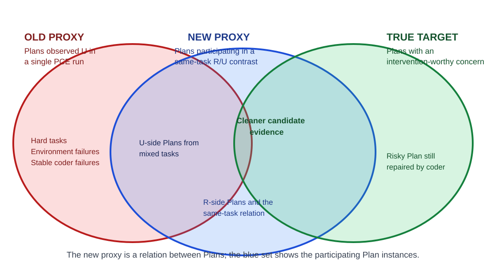

# Learning When to Stop Before Coding

> Twenty-minute collaborator presentation outline, 2026-09-16. This is a
> communication artifact, not runtime or experimental authority.

## Core thesis

We learned to change Checker decisions, but not to improve downstream
implementation. Task-level resolved/unresolved outcomes are useful evidence,
but they are not direct labels for whether a Plan should be blocked.

```text
Vibe coder's question
"Does this Plan contain a concern worth addressing before coding?"
                         |
                         v
Early approach: train the Checker from final R/U outcomes
                         |
                         v
Checker behavior changes, but PCCE produces no stable repairs
                         |
                         v
Three underlying problems
1. R/U is not Plan quality
2. Learned concerns may exceed the Checker's information boundary
3. Historical Plan/PCE evidence was not always reliable
                         |
                         v
Safe PCE + human-readable ACE playbook
                         |
                         v
Current direction: compare different Plans within the same task
```

## Timing

| Slide | Title | Time |
|---:|---|---:|
| 1 | Research question | 0.5 min |
| 2 | Deployment setting | 1.5 min |
| 3 | Experimental stack | 1.5 min |
| 4 | What we tried | 2 min |
| 5 | Main empirical result | 2 min |
| 6 | Why classification did not become intervention benefit | 2.5 min |
| 7 | Rebuilding trustworthy evidence: Safe PCE | 1.5 min |
| 8 | From guidelines to an ACE playbook | 1.5 min |
| 9 | Why the latest ACE search still stalled | 2 min |
| 10 | New evidence: within-task Plan contrasts | 3 min |
| 11 | Current direction and discussion | 2 min |

## Slide 1 — Research question

### Title

**Which Plan concerns are worth blocking before implementation?**

### Content

```text
A Plan deficiency is not automatically a blocker.

We want to learn which concerns are:
- visible before implementation;
- material enough to ask the Agent about;
- and likely to improve downstream implementation.
```

### Speaking point

The objective is not ordinary code review or merely predicting whether an
Agent will eventually succeed. It is helping a developer decide whether it is
safe to begin implementation.

## Slide 2 — Deployment setting

### Visual

```text
Issue + Repository
        |
        v
   Planning Agent
        |
        v
       Plan
        |
        v
Human / Checker asks:
"Is there a material concern?"
        |
   +----+----+
   |         |
 Build    Ask / Revise
```

### Main claim

$$
\text{Plan deficiency} \neq \text{intervention-worthy blocker}
$$

A developer is primarily deciding whether the goal, approach, scope, risk,
open decisions, and validation are sufficient to proceed.

## Slide 3 — Experimental stack

### Visual

```text
                              Learning
Trajectory ----> Reflector ----> Curator ----> Playbook
                                                |
                                                v
Task + Plan (+ Repository) -----------------> Checker
                                                |
                                        Accept / Concerns
                                                |
                                                v
                                           Replanner
                                                |
                                                v
                                           Code Agent
                                                |
                                                v
                                       Official Evaluator
```

### Terms

| Component | Role in this project |
|---|---|
| GEPA | Candidate search, comparison, checkpoints, and resume |
| ACE | Structured persistent playbook, reflection, and curation |
| PCE | Plan → Code → Evaluate; produces downstream outcome evidence |
| PC | Checker-only diagnostic |
| PCCE | Plan → Checker → revision → Code → Evaluate |
| No-repo Checker | Tests concerns visible from Task + Plan |
| Repo Checker | Lets one deployed reviewer Agent verify concerns in the repository |

### Causal boundary

PCE measures an outcome. PCCE measures whether an intervention changes an
outcome. An intervention-mediated improvement requires:

```text
Checker rejection -> Plan revision -> Code -> U-to-R
```

A new Code sample that succeeds after first-round acceptance is not an
intervention improvement.

## Slide 4 — What we tried

### Visual

```text
SWE-chat behavioral labels
          |
          v
Offline / Behavioral GEPA
          |
          v
C2 / C4 learned Checker guidelines
          |
          v
PolyBench + SWE-Verified PC/PCCE
          |
          v
Human-developed C5
          |
          v
ACE-style atomic playbook
          |
          v
Repo-based severity Checker
```

### Speaking points

1. The first supervision source was developer accept/reject behavior.
2. Later experiments used PCE resolved/unresolved as an operational proxy.
3. The latest design uses an incrementally maintained, human-readable ACE
   playbook instead of a monolithic guideline.

## Slide 5 — Main empirical result

### Title

**We changed Checker behavior, but did not obtain stable intervention benefit.**

### Evidence

| Experiment | Apparent improvement | Downstream result |
|---|---|---|
| Offline C2 | Improved SWE validation classification | PolyBench `U→R = 0`, with regression |
| C4 PC-only | Improved bad-plan recall | Full PCCE `U→R = 0` |
| C4 Verified50 | Avoided neutral-Seed degradation | Preserved baseline but repaired no PCE failure |
| Human-developed C5 | Produced more complete and material feedback | Revised cases remained mostly `U→U` |

On the C4 safe67 development set:

```text
21 rejected Plans
7 baseline-unresolved cases among those rejections
0 intervention-mediated U-to-R transitions
```

### Main claim

C4's principal benefit was avoiding unnecessary damage, not repairing failed
implementations.

## Slide 6 — Why classification did not become intervention benefit

### Outcome decomposition

```text
Observed R/U outcome
        |
        +-- Plan quality
        +-- Code Agent fidelity
        +-- Code sampling
        +-- Task difficulty
        +-- Environment
        +-- Evaluator strictness
```

Therefore:

$$
R/U \neq \text{Plan acceptability}
$$

### Three failure sources

#### Proxy mismatch

A good Plan may still be unresolved, while a risky Plan may pass the official
tests.

The case-level rationale audit does **not** support the stronger claim that C2
or C4 cleanly detected an unresolved case for an unrelated or incorrect
reason. C2's four proxy true-positive rejections identified real Plan
deficiencies, but often captured only part of the required contract. For C4,
no clean rejected-unresolved case failed solely for a cause unrelated to the
reported concern.

This still shows why label agreement is insufficient:

```text
Reject + Unresolved
        |
        +-- correct and sufficient rationale      (not established by label)
        +-- valid but incomplete rationale        (observed in C2 and C4)
        +-- valid concern -> harmful correction   (observed in C4)
        +-- incorrect rationale by coincidence    (possible, not cleanly observed)
```

For example, C4 correctly objected to the Plan in `django__django-15127`, but
its corrective feedback encouraged deleting `LEVEL_TAGS`; the revision did so
and the official test then failed because that state contract was required.
Conversely, C4 made a demonstrably false API objection on the resolved
`django__django-15252` case. PC-only correctness therefore cannot validate the
Checker's reason or the safety of acting on it.

#### Information-boundary mismatch

```text
Reflection sees:
Task + Plan + Repository + Code trajectory + evaluator

No-repo Checker sees:
Task + Plan
```

A Reflection can discover a real failure mechanism that the deployed Checker
cannot instantiate from its inputs.

#### Causal mismatch

```text
Rejecting a bad-looking Plan
        !=
producing a better revised Plan
        !=
the Code Agent following that Plan
        !=
the official evaluator resolving the task
```

## Slide 7 — Rebuilding trustworthy evidence: Safe PCE

### Title

**Before learning better rules, we had to make the evidence trustworthy.**

### Historical reliability failures

- Plan artifacts could be truncated or accidentally executed.
- Planner and Code Agent behavior could be affected by `/tmp` side channels.
- Future Git objects or network sources could leak later implementations.
- Evaluator workspace resets could remove official harness preparation.
- Infrastructure failures could be confused with unresolved outcomes.
- Evidence references were not always portable after staging cleanup.

### Safe PCE boundary

```text
Frozen Issue + SIF + base commit
              |
       isolated Planner
              |
       exact Plan text
              |
        isolated Coder
              |
       exact staged patch
              |
 fresh official evaluator
```

Operational failures remain `unknown` or `incomplete`; they are never converted
to `unresolved`.

The current data progression is:

```text
482-case formal universe
        -> 411 reliability-clean completed cases
        -> 400 selected ACE development cases
```

## Slide 8 — From guidelines to an ACE playbook

### Title

**The output must be usable by a human, not only by another coding Agent.**

### Target representation

```text
Reject the Plan when:

- The Plan is a placeholder.
- The Plan knowingly changes behavior outside the requested scope.
- The Plan leaves a material compatibility risk unresolved.
- The proposed validation does not exercise the required behavior.
```

### Design

- One atomic developer concern per bullet.
- Bullets should preferably remain below 32 tokens and must remain below 64.
- Stable IDs and helpful/harmful counters are hidden from the Checker.
- The Curator abstracts reusable concerns across multiple reflections.
- The Refiner performs deduplication, equivalent merging, and deterministic
  counter-based pruning only when the playbook exceeds its length limit.

### Case-level severity

| Level | Meaning | Action |
|---:|---|---|
| 0 | No material intervention needed | Continue |
| 1 | Advisory concern | Give to the Replanner without gating |
| 2 | Material blocker | Stop before implementation |

Severity belongs to the instantiated case finding, not to the persistent
playbook bullet.

## Slide 9 — Why the latest ACE search still stalled

### Title

**The playbook became more readable, but the supervision was still not sufficiently solvable.**

### Search behavior

Increasing the minibatch to 32 let the Reflector and Curator compare more cases
and extract multiple concerns per iteration.

Relative to an all-accept Seed, the candidate score changes approximately as:

$$
\Delta = \text{caught Bad} - 2 \times \text{false rejection of Good}
$$

A candidate therefore needs rejection precision above approximately 66.7% to
beat the Seed. Observed candidate precision was approximately 21%–50%, so the
eight-iteration run retained the Seed.

### Diagnosis

- Some detected problems can be repaired by the Code Agent without Plan
  intervention.
- Some resolved Plans still contain visible design risks.
- Some unresolved outcomes reflect task difficulty or strict tests rather than
  a Plan-stage blocker.
- Repository/evaluator failure patterns are not always deployable review
  knowledge.

**Atomicity and readability improved; causal supervision did not.**

## Slide 10 — New evidence: within-task Plan contrasts

### Title

**The same task can produce Plans whose visible decisions predict different outcomes.**

### Proxy transition

| Stage | Supervision unit | Operational interpretation |
|---|---|---|
| Old proxy | One Plan execution from one task | `U` is treated as evidence of a bad Plan |
| New proxy | Multiple Plan executions for the same task | Compare the U-side and R-side Plans only when the task has mixed outcomes |
| Research target | A case-level Plan concern | The concern is worth resolving before implementation |



Strictly, the new proxy is a relation rather than a unary Plan label. The blue
set in the diagram denotes both the R-side and U-side Plan instances that
participate in a same-task contrast.

The new proxy forms contrasts only for tasks with at least one resolved and one
unresolved sampled Plan. It therefore reduces several major confounds:

| Reduced by the within-task comparison | Why |
|---|---|
| Task difficulty | Always-resolved and always-unresolved tasks do not enter the contrast set |
| Repository and issue differences | Both Plans address the same frozen task and base commit |
| Evaluator-contract differences | Both executions are judged by the same official evaluator |
| Environment differences | Safe PCE holds the SIF and execution protocol fixed |
| Coder-configuration variance | Every new execution uses the same Coder model, prompt, and `0.0` temperature |

It does **not** eliminate Coder fidelity errors, runtime nondeterminism,
evaluator blind spots, or ambiguity when two Plans differ in several ways. It
also selects for outcome-variable tasks and excludes both always-resolved and
always-unresolved tasks. The mixed-outcome label is therefore a cleaner proxy,
not Plan-quality or blocker ground truth.

### Example A: SymPy

Task requirement:

```text
Point(2, 0).distance(Point(1, 0, 2)) == sqrt(5)
```

| U Plan | R Plan |
|---|---|
| Correctly identifies the truncating `zip` | Correctly identifies the truncating `zip` |
| Decides mixed dimensions should raise `ValueError` | Treats the shorter point as zero-padded |
| Contradicts the task's explicit result | Produces the required `sqrt(5)` |
| Code Agent faithfully implements it | Code Agent faithfully implements it |

The root cause was understood in both Plans; their semantic decisions differed.

### Example B: scikit-learn

| U Plan | R Plan |
|---|---|
| Bypasses `_validate_data` and `_transform` | Preserves the established validation path |
| Explicitly acknowledges losing validation and warning behavior | Restores dtype only for opted-in value-preserving transformers |
| Treats the regression as acceptable | Verifies and bounds the compatibility risk |
| Official warning test fails | All target tests pass |

The U Plan states:

> The trade-off is that consistency checking is not performed on this path.
> This is acceptable.

### Main finding

```text
The failed Plan did not miss the risk.
It identified the risk and incorrectly accepted it.
```

Both concerns can be identified from Task + Plan without future implementation
or evaluator evidence.

## Slide 11 — Current direction and discussion

### Title

**Build supervision from within-task Plan contrasts**

### Proposed data construction

```text
Trusted Safe PCE task
        |
        v
Sample multiple Plans
high Planner temperature
        |
        v
Execute each Plan
Coder temperature = 0.0
        |
        v
Retain tasks with mixed R/U outcomes
        |
        v
Manual Plan-stage solvability audit
        |
        v
Learn reusable developer concerns
        |
        v
Evaluate on task-level held-out cases
```

Within-task comparison holds the task, repository, and evaluator contract
fixed while reducing Code-sampling noise.

### Target hypothesis

> Learn reusable developer concerns broadly, instantiate them against a
> concrete Plan and repository, and block only materially
> intervention-worthy findings.

### Questions for collaborators

1. Is within-task Plan comparison a defensible supervision unit for learning
   blocker knowledge?
2. Should candidate selection optimize only blocking decisions, or also the
   quality of advisory concerns?

## Opening and closing

### Opening

> We started by asking whether a Plan predicts implementation success. We now
> think the more useful question is whether the Plan contains a concern worth
> intervening on before coding.

### Closing

> Our current hypothesis is that within-task Plan contrasts can provide cleaner
> supervision for learning intervention-worthy concerns than task-level
> resolved/unresolved labels alone.

## Appendix only

Do not present these unless requested:

- complete C2/C4/C5 outcome matrices;
- construction details for safe67, balanced20, repair3, and 24pcce;
- complete Checker, Reflector, and Curator prompts;
- bullet-counter and Refiner schemas;
- supervisor, Slurm, Aion/Iris, and SIF implementation details;
- exhaustive cleaning rules;
- complete example Plans and patches;
- candidate-pool JSON;
- complete Level 0/1/2 output schemas.
